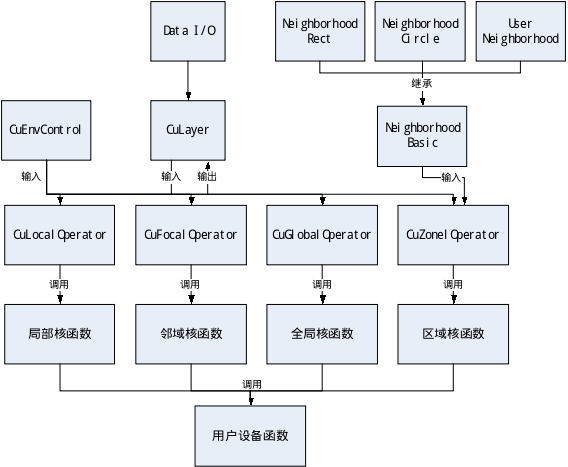
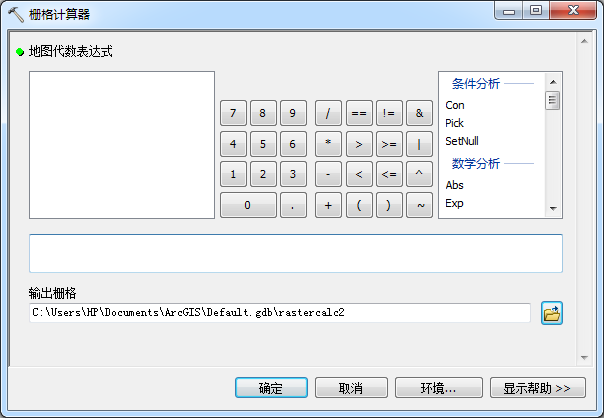
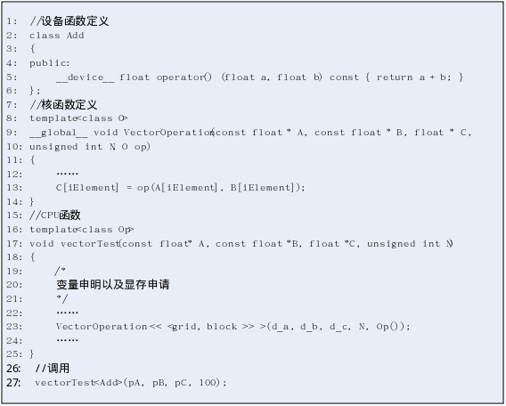
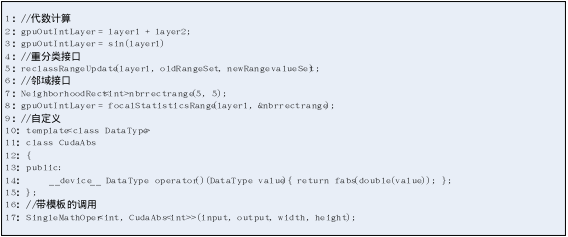

# CuPRL1.0

## 基于CUDA的栅格并行处理编程库
栅格处理具有数据量大和计算复杂的特点，许多高性能计算工具被用于加速栅格计算，并发展出可用于栅格并行处理的可编程库。现有并行库大部分基于进程间通信实现多进程并行，可扩展性较好，但需要大量的计算资源，一般在集群上才能发挥强大的加速性能，单机上加速比不高，还会占用其它任务处理资源。GPU是一种具有强大处理能力的协处理器，计算时不占用CPU计算资源，基于GPU加速的复杂栅格处理算法往往可以获得10倍以上的加速比。现有的可用于栅格处理的GPU并行库主要用于图像处理，设计时没有考虑栅格地理计算特征，栅格地理计算并行化的可用性不强。CUDA是英伟达GPU产品的通用并行编程平台，具有较好的开发生态环境，用来进行GPU并行编程库开发具有一定优势。cuPRL是通过研究CUDA的特性，给出了一种向用户提供参数的可编程开发模式，这种模式中封装了CUDA开发中的大部分语法和函数，让CUDA的数据拷贝、核函数调用，并行模型设置等并行细节对用户透明，并通过模板将自定义部分传入接口中执行。然后分类分析栅格局部计算、邻域计算、区域计算、全局计算特征，抽象每一种计算其所需参数。CuPRL使用一种面向单个栅格单元计算的可编程接口，并通过参数总结了接口类型。最后通过C/C++实现了基于CUDA的栅格处理编程库，并分别使用了多层栅格叠置求平均值、坡度计算、欧氏分配、区域面积统计4个算法作为各个部分的测试算法。实验计算结果表明该库可用性，时间结果表明实现的并行栅格算法体现了GPU的加速特性。对于并行性强的栅格计算，计算复杂度低的算法一般有5-10倍的加速比，计算复杂度适中的算法一般有10-20倍的加速比，计算复杂度较高的算法一般有20倍以上加速比；对于并行性弱的栅格计算，对GPU加速有一定影响，但最高也能达到10倍左右的加速。

### 架构图
下图是CuPRL的并行库的架构。其中CuLayer表示栅格数据模块，CuEnvControl是并行库的环境设置模块。Neighborhood表示邻域模块。Operator表示的是各种不同栅格计算的操作模块，核函数模块是针对不同操作提供的CUDA线程计算接口，用户设备函数模块是用户自定义模块。下面将详细说明各个模块的原理以及实现。

### 并行库环境设置模块
该主要用于提供并行库的并行计算的一些参数，其中主要包括2类设置：
1. 并行模型设置。其主要是线程块大小设置和格网中线程块的设置。CUDA使用双层并行模型，因此用户可以设置每个线程块的大小，在二维情况下，默认使用16*16的线程块模型，在一维情况下，默认使用256个线程。这种设置主要考虑CUDA物理计算原理，支持CUDA的一系列GPU中，其SM（Steam Multiprocessor）的寄存器有限，因此对于需要寄存器较多的计算则不能设置较大的线程块，否则将会存储在显存中从而降低计算速度。很多GPU每个线程块支持最高512或者1024个线程，考虑到处理中寄存器的使用，设置使用256个线程比较适中。线程块在SM中的实际执行是以warp为单位执行的，比如在GeForce系列的GPU中，warp由32个线程组成，即SM将线程块拆分成若干warp，因此一般考虑线程块是warp包含线程数量的整数倍。另外也不适合将每个块中的数据设置太小，因为每个SM有一定的指令执行延迟，因此至少保证一次处理的线程数量才能将执行的延迟隐藏。除了执行有延迟以外，数据访存的延迟更高，因此线程总数量不适合设置太小。目前选取的只是一个相对来说比较合理的设置，在实际的计算中还需要更具实际情况设置的更高。在二维情况下面如果线程计算需要的寄存器较多的情况下，可以将规模设置成8*8，将两个维度上线程设置成一样主要方便计算中的逻辑处理。线程块的设置有几种方式，一是为每一个栅格单元分配一个线程，这样传入栅格的大小即可，二是每个线程执行一定数量的栅格单元计算，这种方式需要给定每个线程计算的栅格单元规模。

2. CUDA计算设置。由于考虑到CUDA并行常常有启动时间，数据拷贝时间等，并不是在任何情况下面都比CPU执行快，因此在CuPRL格处理库中提供了部分CPU下的栅格代数计算，这种计算一般的数据量下往往在GPU下加速效果不好或者比CPU执行更慢，因此提供对CUDA计算的选择设置让用户自行设置简单计算时的时间。

该模块提供的对象中全部都是静态方法，并对应了相应的静态数据成员，为这些数据成员设置了初始值，使用时可以直接在各个需要使用的地方直接通过静态类的方法调用，用户可以根据自己的需求进行更改。

### 栅格数据模块

这个模块在该库中主要用于表示计算的栅格。其中主要包含了栅格数据的读写、栅格数据的运算符操作。栅格数据模块中通过栅格数据读写模块载入和输出栅格数据，CuPRL读写基于GDAL开发。如下图所示，这是ArcGIS中的栅格计算器，它可以通过简单的操作函数和操作符做栅格计算，CuPRL提供类似的计算，对简单的栅格图层之间的代数或者单个栅格中的代数运算的支持，在栅格数据模块中重载常用的操作符，从而支持栅格之间的各种数据运算，由于这种计算常常比较简单，在数据规模不大的情况下本身运算计算时间太短，加速意义不大，但是对于稍微复杂的计算，使用这种加速有能为整体程序执行提高一定的执行效率。由于CUDA在数据规模不大或计算简单的情况下加速幅度小，加速时间短，因此在重载的运算符中还提供了CPU下的串行计算。可以通过环境模块设置。

### 邻域模块

邻域由于在实际的算法中可能出现的太多，因此在CuPRL的并行库中设计了一种基于继承的邻域生成方式，用户通过继承邻域虚基类，实现指定的纯虚函数作为接口，然后传入邻域计算的操作函数或者类中。

邻域模块中通过邻域对象定义了邻域表示方式。CuPRL中的邻域通过两组数据表示，一组是邻域中各个栅格单元相对焦点栅格单元的相对位置，另一组是和第一组对应的邻域中各个栅格单元的权重值。在重复邻域操作中，对同一栅格进行不同邻域处理时可以将多个邻域传入，并在程序中通过自己设置的长度区分。比如对于类似坡度的计算，可以在一次GPU计算中处理。对于只需要指定邻域栅格单元位置的计算，权重值设置为1即可。

### 用户设备函数模块

这一模块是用户自定义代码编写的地方。CuPRL中通过函数类来实现，并且是对栅格单元做计算，而不用关心其在CUDA中如何并行分配栅格操作给各个线程，一个线程是处理多个栅格还是处理单个栅格都对用户透明。这种方式可以用户自己定义函数参数，这种定义需要满足给定的模板。然后将该函数类传递到相关的模板函数中即可执行。如下图所示，这是两个矢量求和在CUDA下函数类的实现以及通过模板的调用方式。图中2-6行是设备类函数的定义，用户通过重载（）操作符，并加入需要的参数，然后在函数体中计算，并返回一定的值。可以看到这种操作比较简单，如果对核函数（图中8-14行）以及CPU接口函数（图中16-25行）的部分进行封装后，只需要在调用时将定义的函数类模板的类型传入接口，并提供接口所需的参数即可（图中27行）。

这一部分重载操作符中的参数定义是通过给定的模板来设置的，一般是对不同算法的计算都有对应的设备函数类模板和一个对应的接口。通过使用函数类而不通过不同对象或者不同接口来提供的主要原因是如果使用了具体的对象或接口，则确定了对象或者函数的功能，而在此前对栅格处理的分析中可以发现，对于一些处理需要的参数类型可以相同，但其所属的计算可能完全不同。而使用这种方式用户可以更具具体计算定义类的名称，而且可以按照模板选取不同的参数，并给参数命名时可以为参数提供一定的意义。
除了不明确参数意义自定义方式外，还可以通过传入具有意义的对象的方式提供设备函数类的计算，这种方式下参数是一个个参数对象，计算需要的参数信息通过对象获取，其参数需要通过操作层传入，否则将无法使用。需要注意的是，由于CUDA中不支持动态申请内存的操作，也不支持CPU下的函数，所以不能使用内从申请函数，也不能调用其它CPU函数。

### 核函数模块

核函数是CUDA中线程执行的函数，因此这一模块部分封装了CUDA线程执行的部分内容。对于不同类型的操作和算法，会有不同的封装过程。这里是按照提供给用户的函数类参数来编写的。虽然CuPRL对不同类型操作分别做了实现，但是每个模块中都有部分相同的封装。下面将从不同角度说明封装的实现。虽然暴露给用户的是对单个栅格单元的处理，从外面看来好像是每个栅格都用了独立的线程进行处理，但是在实现中可能出现一个线程处理多个栅格单元，也可能是一个线程会执行多种不同的操作。

从线程处理粒度来说，CuPRL给出了几种不同的处理方式，其中主要是一对一的线程分配方式，按行处理，按列处理，以及在以上这几种方式上进行的细分。一对一分配的方式是最容易处理的方式，每个核函数中都执行用户自定义设备函数即可，唯一需要判断的是线程是否分配了计算栅格。按行或者按列的分配方案设置的线程数和栅格的行数或者列数相同，获取线程的索引可以确定当前线程需要处理的行或者列，然后在核函数中设置循环，串行的执行用户设备函数。其它的划分，比如多行或者多列划分，或者按块的划分都可以在核函数中通过线程索引来设置循环执行。

以上的方式只针对单个栅格计算独立的情况下面，而对于一些统计计算，栅格之间通过统计量发生联系，因此在核函数中封装这种联系的过程。比如对于区域面积统计，对于用户来说，依然对当前栅格操作，返回了当前栅格的面积，但是处理是将会是通过一个进程计算一块栅格，然后将结果在进行统计。

### 操作模块

操作模块对不同的栅格处理分开实现，上层通过函数接口的形式提供给用户，下层是数据管理和对核函数层的调用，其中下层对用户透明。用户根据接口以及其对应的自定义函数模板编写程序，接口的参数选取用户需要根据操作来确定，每一个设备函数层的参数列表都对应一个接口的参数列表。封装的部分主要是将内存中的变量拷贝到设备端，包括显存申请、拷贝、初始化等操作。然后通过环境模块的CUDA并行模型，设置该次计算的并行模型，并利用该模型调用核函数，最后将计算结果从设备端拷贝回内存。

## **并行库使用**

并行库提供了几种使用方式。其中主要分为用户自定义和内置操作。

内置操作以接口和栅格对象算术计算的形式提供。具体支持如下：

1. 局部计算接口包括对栅格的三角函数计算、指数计算、幂计算等数学计算，ArcGIS地图代数工具提供的栅格之间的数学计算，栅格叠置运算（多层栅格求最大值、最小值、均值等），重分类计算。
2. 邻域计算接口包括对邻域的统计，主要是邻域内统计，比如最大值、最小值、中值、均值、方差等
3. 区域计算接口主要是区域的统计，如区域最大值、最小值、面积、周长等。
4. 全局计算接口主要是欧氏距离、方向、分配计算。以及通过迭代计算的成本距离计算。

用户自定义的操作需要编写自己的函数类，根据计算类型选择CuPRL提供的参数列表类型，然后实现对单个栅格单元的操作，对于统计类的则是返回该处栅格单元计算得到的值，比如面积统计则是返回单个单元的面积，区域最大值比较返回当前栅格单元属性栅格的值，比较的过程会对用户透明。最后通过操作层接口以模板的类的形式将该类传入。

如下图所示，列举了几种不同的使用。其中1-3行表示代数栅格图层的代数计算，4-5行是一般的功能接口的例子，这里是重分类，6-8行是简单的重分类计算，这里是统计了邻域内值的范围大小。其中7行是定义的一个5*5的方形邻域。9-17行是自定义的使用，其中10-15行是用户定义的函数类，实现了取绝对值的操作，17行中将该类传入，可以看到用户定义是支持模板操作的，可以使用任意类型。

